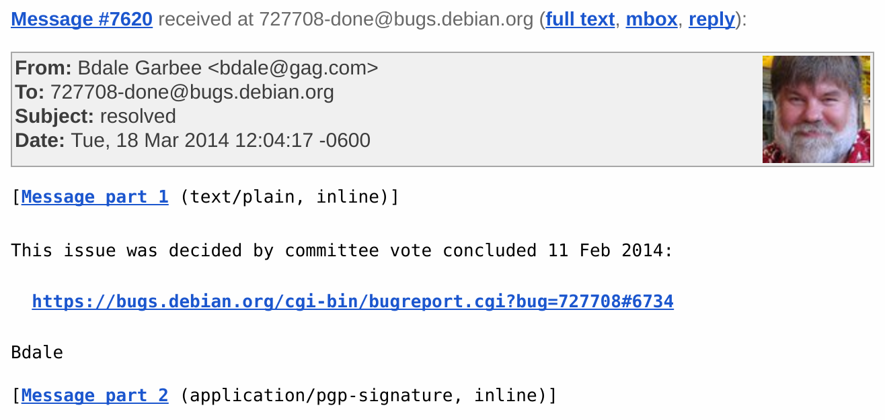
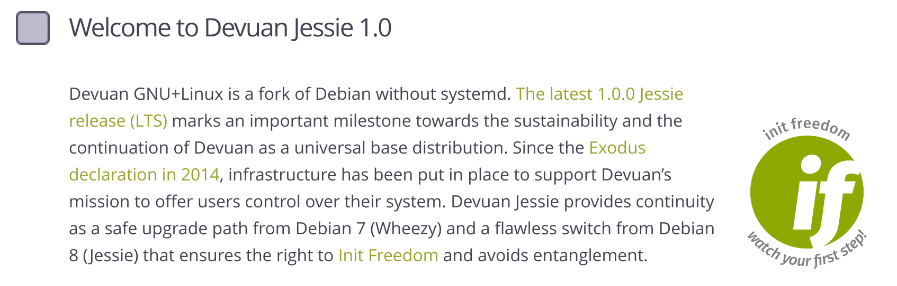

:data-transition-duration: 200
:css: css/presentation.css
:data-rotate-x: 20

.. title:: Systemd

.. header::

   .. image:: images/logo.jpg

.. footer::

    "systemd", Stig Sandbeck Mathisen, Sopra Steria 2017

----

whoami
======

::

   # getent passwd ssm
   ssm:x:1000:1000:Stig Sandbeck Mathisen:/home/ssm:/bin/zsh

* Lead Infrastructure Engineer
* Debian Developer
* Red Hat Certified Architect

----

pid 1?
======

----

PID 1 alternatives
==================

* System V init
* Daemontools
* Launchd
* Systemd
* SMF

.. note::

   SMF on Solaris, Lots of XML

   Launchd on Macos. Released in 2005.  Lots of property lists (XML,
   or binary)

   Daemontools from DJB.  Released in 2001. Not very POSIX, but solved
   a lot of problems.

----

System V init
=============

* Reads /etc/inittab
* Runs scripts in /etc/init.d/
* Stateless

----

systemd
=======

* Declarative syntax
* Service supervisor
* Stateful

----

init script example
===================

.. code-block:: shell

   #!/bin/sh

   set -e

   case $1 in
     start)
       start_service
       ;;
     stop)
       stop_service
       ;;
   esac

----

systemd unit example
====================

.. code-block:: ini

   [Unit]
   Description=System Logging Service
   Requires=syslog.socket
   Documentation=man:rsyslogd(8)
   Documentation=http://www.rsyslog.com/doc/

   [Service]
   Type=notify
   ExecStart=/usr/sbin/rsyslogd -n
   StandardOutput=null
   Restart=on-failure

   [Install]
   WantedBy=multi-user.target
   Alias=syslog.service

----

Not entirely uncontroversial
============================

----

Debian chooses default init
===========================

.. note::

   Discussion closed after 7620 messages.  Not all of them civil.

   The technical committee member reviews of the various init systems
   are very much worth reading.

----

Debian without systemd
======================

.. note::

   Some very resourceful and creative people left Debian for Devuan.
   Apart from that, a fork in itself is not a big deal.

   Debian has 300 derivative distributions, of which 120 is still
   active.  (https://wiki.debian.org/Derivatives/)

----

Systemd unit types
==================

* service
* socket
* timer
* target
* device
* mount
* ...

----

systemctl
=========

* systemctl start
* systemctl stop
* systemctl restart
* systemctl status
* ...

----

service status
==============

::

   ssm@eris:~$ systemctl status rsyslog
   ● rsyslog.service - System Logging Service
      Loaded: loaded (/lib/systemd/system/rsyslog.service; enabled; vendor preset:
      Active: active (running) since Wed 2017-06-21 06:23:15 CEST; 5 days ago
	Docs: man:rsyslogd(8)
	      http://www.rsyslog.com/doc/
    Main PID: 642 (rsyslogd)
       Tasks: 4 (limit: 4915)
      Memory: 4.6M
	 CPU: 1.281s
      CGroup: /system.slice/rsyslog.service
	      └─642 /usr/sbin/rsyslogd -n

----

multi process service status
============================

::

   ssm@eris:~$ systemctl status postfix@-.service
   ● postfix@-.service - Postfix Mail Transport Agent (instance -)
      Loaded: loaded (/lib/systemd/system/postfix@.service; disabled; vendor preset
      Active: active (running) since Wed 2017-06-21 06:23:20 CEST; 5 days ago
	Docs: man:postfix(1)
     Process: 13129 ExecReload=/usr/sbin/postmulti -i - -p reload (code=exited, sta
     Process: 1074 ExecStart=/usr/sbin/postmulti -i - -p start (code=exited, status
     Process: 1012 ExecStartPre=/usr/lib/postfix/configure-instance.sh - (code=exit
       Tasks: 3 (limit: 4915)
      CGroup: /system.slice/system-postfix.slice/postfix@-.service
	      ├─ 1181 /usr/lib/postfix/sbin/master -w
	      ├─13142 qmgr -l -t unix -u
	      └─19646 pickup -l -t unix -u -c

----

systemd-cgls
============

::

   Control group /:
   -.slice
   ├─user.slice
   │ ├─user-117.slice
   │ │ ├─user@117.service
   │ │ │ ├─pulseaudio.service
   ...
   └─system.slice
   ├─system-postfix.slice
   │ └─postfix@-.service
   │   ├─ 1181 /usr/lib/postfix/sbin/master -w
   │   ├─13142 qmgr -l -t unix -u
   │   └─19646 pickup -l -t unix -u -c

----

systemd-cgtop
=============

::

   Control Group                   Tasks   %CPU   Memory  Input/s Output/s
   /                                   -   13.8     4.8G        -        -
   /user.slice                       487   13.0     3.9G        -        -
   /system.slice                      91    0.3   442.9M        -        -
   /system.slice/docker.service       33    0.3   100.3M        -        -
   /docker                             -      -   136.0K        -        -
   /init.scope                         1      -     8.1M        -        -
   ...

----

Some systemd features
=====================

A few of systemd features that helps you and your fellow sysadmins.

.. note::

   At 3am, I want to sleep. I do not want SMS with “Service X is
   down”, and I do not want my systems to wake the on-call personnel,
   so they can scratch their heads and call me about “Service X is
   down, and I need help fixing it”.

   There are a couple of things you can do to avoid this.

----

Automatic restarts
------------------

* Processes die
* Automatic restart

.. code-block:: ini

   [Unit]
   Description=Enterpricy Software by Undead Vendor
   Documentation=file:///dev/null man:hahaha(5)

   [Service]
   ExecStart=/opt/ENTRprc/zbin/eeek
   Restart=always

.. note::

   Sometimes processes die. Particularly at inconvenient times, it
   seems. In many cases, the fix is to “restart it, and figure out the
   cause later”. You can configure systemd to restart your service. If
   the restart is successful, the service is not unavailable, and no
   SMS is sent.

   The “Restart=” directive tells systemd to restart the service if the
   process terminates. You can set it to “always”, or read the manual
   page to see if the other values make sense for you.

   Just ensure you follow up on unexpected service restarts. This is
   logged in the journal, and you should add this to your monitoring.

----

Improved documentation
----------------------

.. code-block:: ini

   [Unit]
   Documentation=https://wiki.corp.example.org/SomeClient/CommonFailures \
     https://www.enterpricy.example.org/Documentation/ \
     man:mysteryd(8) \
     file:///opt/mystery/doc/index.html

.. note::

   Not all services are well known, or well documented. The on-call
   personnel may not be the one responsible for the architecture or
   the day-to-day operations for that server.

   The content of the “Documentation=” directive is visible when
   running “systemctl status servicename”. This helps your on-call
   person, when the alarm goes off, to figure out what is wrong, and
   how to fix it. Add your own service documentation, and a link to
   the upstream documentation.

   You don’t need to edit the original unit file, you can add a drop-in
   file in /etc/systemd/system/<yourservice>.d/<something>.conf:

   # create /etc/systemd/system/mystery.service.d/documentation.conf

----

The output will look like this:

::

  root@turbotape:~# systemctl status mystery.service
  ● mystery.service - MYSTERY Scheduler
     Loaded: loaded (/lib/systemd/system/mystery.service; enabled; vendor preset: enabled)
    Drop-In: /etc/systemd/system/mystery.service.d
	     └─documentation.conf
     Active: active (running) since Mon 2016-11-28 06:25:01 CET; 6h ago
       Docs: man:mysteryd(8)
	     https://wiki.corp.example.org/SomeClient/CommonFailures
	     https://www.enterpricy.example.org/Documentation/
	     man:mysteryd(8)
	     file:///opt/mystery/doc/index.html
   Main PID: 10015 (mysteryd)
	CPU: 251ms
     CGroup: /system.slice/mystery.service
	     ├─10015 /usr/sbin/mysteryd -l
	     └─10218 /usr/lib/mystery/notifier/dbus dbus://

  Nov 28 06:25:01 turbotape systemd[1]: Started MYSTERY Scheduler.

----

Show connections for a service
------------------------------

Systemd tracks all processes per service by placing them in the same
cgroup.

Using “ps”, “awk” and “lsof”, we can print network connections for a
single service, across multiple processes.

.. code-block:: shell

   ps -e -o pid,cgroup \
     | awk '$2 ~ /dovecot.service/ {print "-p", $1}' \
     | xargs -r lsof -n -i -a

.. note::

   What does it do?

   The example lists all processes started by “dovecot.service”.

   * List all running processes, and print pid and cgroup on each line.

     * For each line, check if the “cgroup” matches our regular
       expression, and print the pid. Actually, print a “-p”, and the
       pid, since this is used by lsof.

     * Use “xargs” to take the “-p $pid” lines from STDIN, and add
       them to the “lsof” command line.

----

Example output

::

  root@mail1:~# ps -e -o pid,cgroup \
  >       | awk '$2 ~ /dovecot.service/ {print "-p", $1}' \
  >       | xargs -r lsof -n -i -a
  COMMAND   PID USER   FD   TYPE   DEVICE SIZE/OFF NODE NAME
  dovecot 17335 root   31u  IPv4 11520166      0t0  TCP *:imap2 (LISTEN)
  dovecot 17335 root   32u  IPv6 11520167      0t0  TCP *:imap2 (LISTEN)
  dovecot 17335 root   33u  IPv4 11520168      0t0  TCP *:imaps (LISTEN)
  dovecot 17335 root   34u  IPv6 11520169      0t0  TCP *:imaps (LISTEN)
  imap-logi 17564 dovenull   18u  IPv6 25385800      0t0  TCP [2001:db8::de:caf:bad]:imaps->[2001:db8::c0:ff:ee]:55043 (ESTABLISHED)

.. note::

   Here, we see that the “dovecot.service” unit has a number of listening
   ports, and one established session.

----

Logging
=======

Systemd logs to the journal.

----

Journal
=======

* Binary
* Structured
* Ephemeral or Persistent

----

journalctl
==========

::

   # journalctl -p3 -b
   # journalctl -u postfix.service
   # journalctl -f

---

That's it
=========

Thank you!
